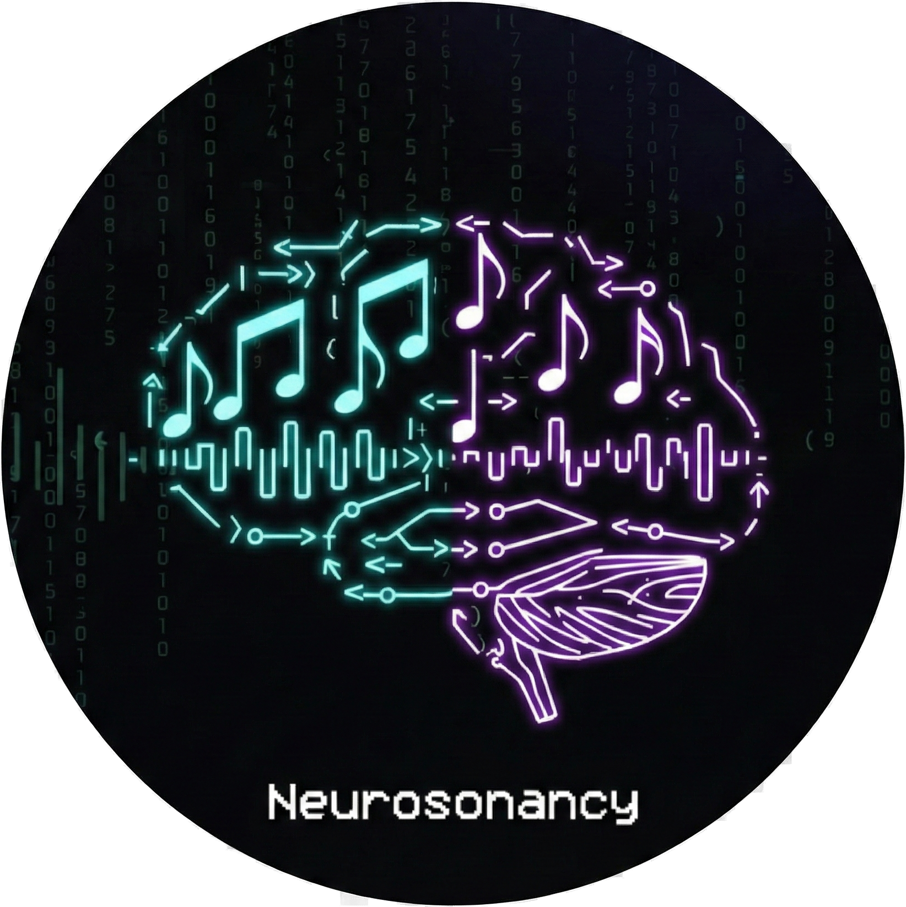

<div align="center">

[](#)
[](https://www.gnu.org/licenses/gpl-3.0)
[](https://www.python.org/)
[](https://github.com/seu-usuario/Neurosonancy/issues)

<h1>NEUROSONANCY</h1>


**Voice Cloning & Training Toolkit**

</div>

---

## Descricao

Neurosonancy e um toolkit completo para clonagem e treinamento de vozes, com interface TUI moderna (Textual) em tema Dracula. Integra ElevenLabs API para geracao de datasets e suporta fine-tuning com Chatterbox TTS e Coqui XTTS.

---

## Modulos

### Clone Voice
Modulo principal para clonagem de voz:
- Geracao de datasets via ElevenLabs API
- Suporte a formato LJSpeech (metadata.csv + wavs/)
- Suporte a formato Chatterbox (JSONL + wavs/)
- Treinamento Chatterbox TTS (12GB VRAM)
- Treinamento Coqui XTTS v2 (8GB VRAM)

### ASCII Control
Monitor de audio com visualizacao de metricas em tempo real.

### Voice Trainer
Gravador de amostras para treinamento com transcricao automatica via Whisper.

---

## Instalacao

```bash
chmod +x install.sh
./install.sh
```

O instalador cria 3 ambientes virtuais separados:
- `venv/` - Interface principal + ElevenLabs
- `venv_chatterbox/` - Treinamento Chatterbox TTS
- `venv_coqui/` - Treinamento Coqui XTTS

---

## Execucao

```bash
source venv/bin/activate
python3 main.py
```

---

## Estrutura

```
Neurosonancy/
├── main.py                    # Orquestrador
├── install.sh                 # Setup (3 venvs)
├── uninstall.sh               # Remocao limpa
├── requirements.txt           # Dependencias core
├── src/
│   ├── gui/
│   │   └── main_menu.py       # Menu principal
│   └── modules/
│       ├── clone_voice/       # Clonagem de voz
│       │   ├── core/
│       │   │   ├── generator/ # ElevenLabs + Dataset
│       │   │   └── training/  # Chatterbox + Coqui
│       │   └── ui/
│       ├── ascii_control/     # Monitor de audio
│       └── voice_trainer/     # Gravador de voz
├── data_input/                # Arquivos de entrada
│   ├── phrases_*.md           # Frases para dataset
│   └── clone_voice_config.json
├── data_output/               # Datasets gerados
├── assets/
│   └── icon.png
├── logs/
└── docs/
```

---

## Uso: Clone Voice

1. Configure a API Key do ElevenLabs
2. Selecione a voz de origem
3. Carregue um arquivo de frases (.md ou .txt)
4. Gere o dataset
5. Treine com Chatterbox ou Coqui

### Formato do Arquivo de Frases

```markdown
# Frases para Dataset
- Primeira frase para geracao
- Segunda frase para geracao
- Terceira frase para geracao
```

---

## Requisitos de Hardware

| Modelo | VRAM Minima | Amostras Minimas |
|--------|-------------|------------------|
| Chatterbox TTS | 12GB | 10 |
| Coqui XTTS v2 | 8GB | 5 |

---

## Requisitos de Sistema

- Python 3.10+
- Sistema Linux (testado em Pop!_OS)
- GPU NVIDIA com CUDA (para treinamento)
- API Key ElevenLabs (para geracao de dataset)

---

## Licenca

GPLv3 - Consulte o arquivo LICENSE
