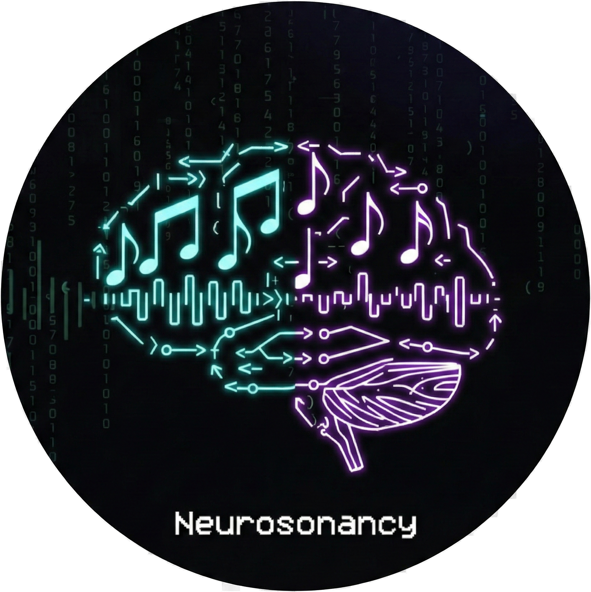

<div align="center">

[](#)
[](https://www.gnu.org/licenses/gpl-3.0)
[](https://www.python.org/)
[](CHANGELOG.md)

<h1>NEUROSONANCY</h1>


**Toolkit TUI para clonagem, treinamento e leitura de textos com TTS local**

</div>

---

## Descrição

Neurosonancy é um toolkit completo em TUI (Textual + tema Dracula) que reúne quatro módulos coordenados por um único app:

- geração de datasets de voz via ElevenLabs
- treinamento de modelos TTS locais (Coqui XTTS v2 e Chatterbox)
- síntese de fala em tempo real para textos arbitrários
- monitoramento de áudio do sistema com integração MPRIS

A síntese roda em **daemons persistentes** (coqui + chatterbox), com cache de modelo carregado, fallback automático para subprocess e degradação graceful para CPU quando a GPU está saturada.

---

## Módulos (abas)

| Tecla | Aba | Função |
|-------|-----|--------|
| `1` | **Media Monitor** | Monitor de áudio do sistema (ASCII control + MPRIS) |
| `2` | **Voice Trainer** | Gravação e transcrição via Whisper para fine-tuning |
| `3` | **Clone Voice** | Geração de datasets ElevenLabs + treinamento local |
| `4` | **Leitor de Textos** | Síntese de TXT/MD/DOCX/PDF com voz clonada |

`Ctrl+T` alterna o ícone de bandeja; `Q` sai.

---

## Instalação

```bash
git clone <repo> Neurosonancy
cd Neurosonancy
make install        # cria os 3 venvs, instala deps e baixa o XTTS v2
make trim-references   # opcional — recorta unified_reference.wav em 15–30 s por entidade
```

Ver [docs/INSTALL.md](docs/INSTALL.md) para passo a passo, troubleshooting de GPU/CUDA e instalação manual.

---

## Execução

```bash
make run            # roda ./run.sh (valida ambiente e lança o app no TTY atual)
make run-terminal   # abre o app em um terminal novo (kitty/gnome-terminal/xterm)
./run.sh --check    # apenas valida o ambiente, sem subir a UI
```

---

## Comandos `make` mais usados

```bash
make download-models     # baixa/valida XTTS v2 em models/coqui/
make trim-references     # recorta references por entidade (melhora qualidade do TTS)
make tts-start ENGINE=coqui      # sobe daemon do engine
make tts-stop  ENGINE=coqui      # encerra daemon do engine
make tts-status                  # health-check dos dois daemons
make tts-start-all               # sobe ambos os daemons
make tts-stop-all                # encerra ambos
make clean                       # limpa __pycache__/*.pyc
make help                        # lista todos os targets
```

---

## Estrutura

```
Neurosonancy/
├── main.py                      # entry-point → NeurosonancyUnifiedApp
├── run.sh                       # launcher com --check
├── install.sh / uninstall.sh    # setup dos 3 venvs
├── Makefile                     # targets de instalação, daemon, release
├── pyproject.toml               # metadados + deps
├── requirements.txt             # deps do venv principal
├── src/
│   ├── unified_app.py           # NeurosonancyUnifiedApp(App) — 4 panels
│   ├── core/
│   │   ├── theme.py             # COLORS + CSS_COMMON
│   │   ├── model_manager.py     # singleton de modelos TTS
│   │   ├── media_bridge.py      # MPRIS via dbus-next (opcional)
│   │   ├── tray_companion.py    # system tray via pystray (opcional)
│   │   ├── coqui_runner.py      # synthesize() / synthesize_chunked() via daemon
│   │   ├── audio_utils.py       # concat_wavs_to_mp3, get_audio_duration
│   │   └── widgets/             # NavSidebar, MediaHeader
│   ├── modules/
│   │   ├── ascii_control/       # Monitor de áudio
│   │   ├── voice_trainer/       # Gravador + Whisper
│   │   ├── clone_voice/         # ElevenLabs + treinamento
│   │   └── leitor_textos/       # TTS de textos arbitrários
│   └── tools/
│       └── tts_daemon/          # client/server unix-socket
│           ├── daemon.py        # daemon dos engines coqui/chatterbox
│           ├── client.py        # ensure_running, synthesize, status
│           └── constants.py     # timeouts dinâmicos
├── scripts/
│   ├── download_models.sh       # baixa XTTS v2
│   ├── trim_reference.py        # recorta unified_reference.wav (VAD)
│   ├── play_lore_inteiro.py     # narração ElevenLabs do lore (Éris)
│   └── launch.sh                # abre o app em terminal externo
├── models/                      # pesos TTS (gitignored)
├── data_input/                  # phrases_*.md, entity_profiles.json (privado)
├── data_output/                 # datasets gerados (privado)
├── assets/                      # icon.png
├── docs/
│   ├── ARCHITECTURE.md
│   ├── INSTALL.md
│   └── sprints/                 # histórico de sprints
├── tests/
└── venv*/                       # 3 venvs isolados (gitignored)
```

Detalhes em [docs/ARCHITECTURE.md](docs/ARCHITECTURE.md).

---

## Backends TTS

| Engine | Venv | VRAM | Uso |
|--------|------|------|-----|
| Coqui XTTS v2 | `venv_coqui/` | 8 GB | síntese rápida + treinamento |
| Chatterbox MTL | `venv_chatterbox/` | 12 GB | síntese alternativa (mais sensível à reference) |
| ElevenLabs API | `venv/` | — | geração de datasets cloud |

Ambos engines locais só suportam o código de idioma `pt` genérico — o sotaque resultante vem da `reference.wav`. Ver [MODELS.md](MODELS.md) para detalhes e mitigações.

---

## Requisitos

- Python 3.10+
- Linux (testado em Pop!_OS / Ubuntu 22.04+)
- GPU NVIDIA com CUDA 11.8+ recomendada para treinamento e síntese rápida
- 16 GB RAM mínimo, 50 GB de disco livre
- API Key ElevenLabs (apenas para o módulo Clone Voice gerar dataset cloud)

---

## Contribuindo

Veja [CONTRIBUTING.md](CONTRIBUTING.md), [CODE_OF_CONDUCT.md](CODE_OF_CONDUCT.md) e [SECURITY.md](SECURITY.md).

---

## Licença

GPL-3.0-or-later — ver [LICENSE](LICENSE).
